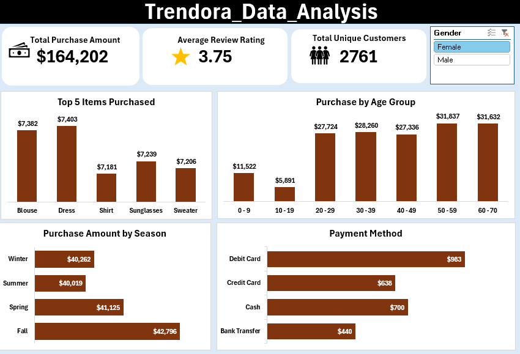
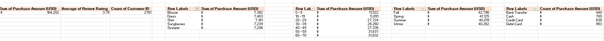

# Trendora Customer Purchase Analysis Report
Analyzing customer transaction data to understand product performance, demographics, seasonal spending, and payment behavior using Microsoft Excel.

## Executive Summary
- Trendora lacked a centralized reporting view to monitor customer purchase behavior, product performance, and payment trends. The available data was stored at the transaction level, making it difficult for stakeholders to quickly extract insights.
- An interactive Excel dashboard was developed using PivotTables, PivotCharts, and slicers to track key performance indicators (KPIs) and customer trends. The solution consolidated purchase data from 2,761 customers, enabling real-time filtering and visual analysis.
- The dashboard revealed $164,202 in total revenue with an average customer review rating of 3.75. Dresses and Blouses emerged as the highest-revenue products, customers aged 50–59 were the top spenders, Fall recorded the strongest seasonal sales, and Debit Cards were the most preferred payment method. These insights provide a clear foundation for targeted marketing, inventory optimization, and improved payment strategy.

## The Business Problem
Trendora required a data-driven approach to better understand customer purchasing patterns and product performance. Stakeholders needed to move from raw spreadsheet data to a structured dashboard that supports faster and more informed decision-making.

### Key Questions Addressed:
-	What is the total revenue and customer satisfaction level?
-	Which products generate the most sales?
-	Which customer age groups contribute the highest revenue?
-	Which seasons drive higher spending?
-	What payment methods do customers prefer?

## The Process (Methodology)
### Tools Used:
Microsoft Excel, PivotTables, PivotCharts, Slicers

## Data Sourcing & Overview
The dataset consists of transaction-level customer purchase records, including demographic information, product details, purchase amounts, review ratings, seasonal data, and payment methods.

## Data Cleaning & Transformation (ETL)
The dataset was prepared for analysis by:
-	Standardizing categorical fields such as Season and Payment Method
-	Ensuring consistent formatting for numeric and text columns
-	Removing irregular or incomplete entries
	Creating PivotTables to aggregate revenue by product, age group, season, and payment type

## Analysis & Insights
This section translates the dashboard visuals into business insights.

### KPI Performance
Total revenue reached $164,202 across 2,761 unique customers, indicating a strong customer base.
The average review rating of 3.75 suggests moderate customer satisfaction with room for improvement.

### Product Performance
The top five revenue-generating products are:
Dress9 $7,403),	Blouse( $7,382), Sunglasses ($7,239), Sweater ($7,206),	Shirt ($7,181).
Clothing items dominate the top positions, indicating that apparel is the primary revenue driver for Trendora.

### Customer Demographics (Age Group)
Customers aged 50–59 generated the highest revenue ($31,837), followed closely by 60–70.
Teenagers aged 10–19 contributed the least ($5,891).
This highlights middle-aged and older customers as the most valuable spending segment.

### Seasonal Sales Trends
Seasonal revenue distribution shows relatively stable performance throughout the year, with a slight peak in Fall ($42,796) and the lowest sales in Summer ($40,019).
This suggests consistent demand with an opportunity for targeted summer promotions to boost sales.

### Payment Method Preferences
Payment behavior is led by Debit Cards (983 transactions), followed by Cash (700) and Credit Cards (638), while Bank Transfers (440) are the least used.
This indicates a strong preference for card-based payments and highlights the importance of maintaining efficient card processing systems.

## Recommendations
Based on the analysis, the following actions are recommended for Trendora:
-	Prioritize marketing campaigns and loyalty programs for customers aged 50–70, as they generate the highest revenue.
-	Increase inventory and promotional focus on Dresses and Blouses, which are the top-performing products.
-	Leverage Fall season demand with targeted promotions and new product launches.
-	Implement strategies to boost engagement among younger customers (10–19) to expand the customer base.
-	Optimize and promote debit and credit card payment options, as they are the most preferred methods.
-	Improve customer experience initiatives to raise the average review rating above 4.0.

